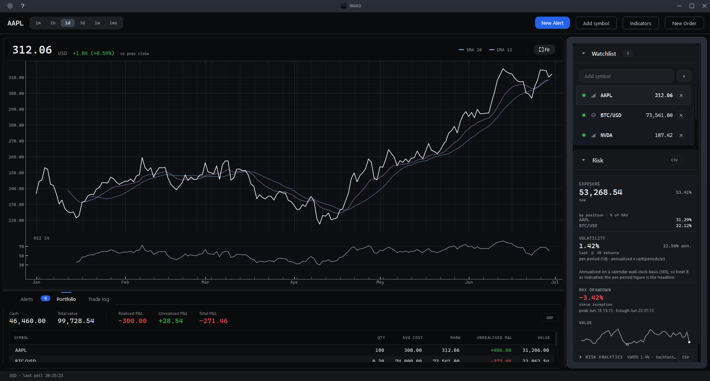
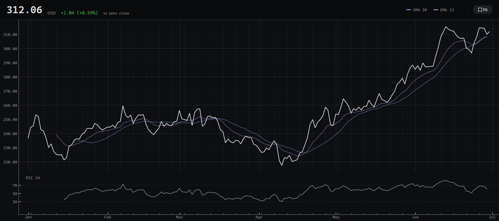
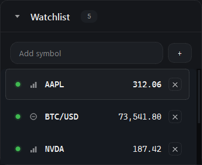
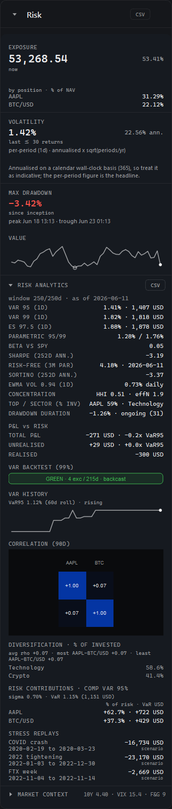
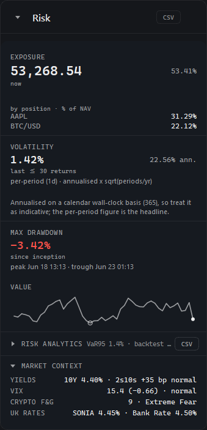
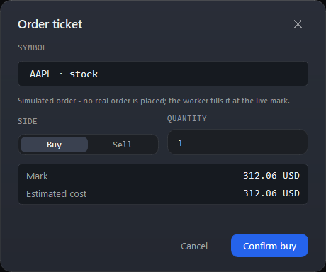
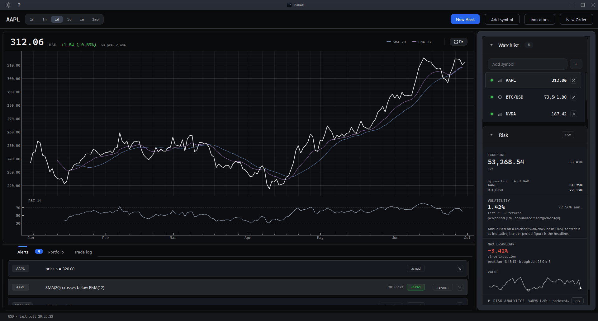
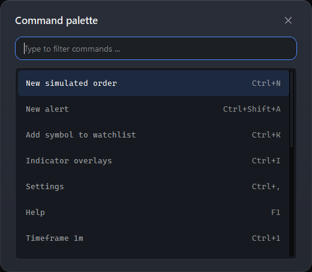

<div align="center">

# MAHAD

### A desktop market-risk workstation for live stock and crypto markets

 &nbsp; &nbsp;

</div>

<p align="center"></p>

<p align="center"><i>One window: a live price chart, a watchlist, the risk panel, and a simulated portfolio with live profit and loss.</i></p>

MAHAD is a desktop risk tool that runs on **live market data**. It charts stocks and crypto, runs a **simulated USD portfolio** with live profit and loss, and layers a full **market-risk analytics suite** on top. The portfolio is a simulation, so MAHAD holds no broker or trading credentials and never places a real order.

## Highlights

- **Live chart** - price with SMA, EMA, and RSI overlays, across timeframes from one minute to one month.
- **Watchlist** - follow several stocks and crypto pairs at once; click any row to make it the active chart.
- **Simulated portfolio** - place simulated buy and sell orders and watch cash, positions, and live profit and loss update on every tick.
- **Risk analytics** - Value-at-Risk, Expected Shortfall, component VaR, beta, Sharpe and Sortino, EWMA volatility, drawdown, concentration, a correlation heatmap, and a Basel-style backtest.
- **Market context** - the Treasury yield curve and 2s10s spread, the VIX, the crypto Fear & Greed index, and UK rates.
- **Alerts** - set a price or indicator alert and get a one-shot notification when it fires.
- **Command palette** - press Ctrl+Shift+P for a searchable, keyboard-driven list of every command.

## A closer look

### Live chart with indicators

<p align="center"></p>

The price chart carries SMA, EMA, and RSI overlays and switches across timeframes from one minute to one month. Indicators are computed on closed bars only, so the lines never flicker on the forming bar.

### Watchlist



Follow stocks and crypto side by side. Each row shows the latest mark, and clicking one makes it the active symbol on the chart. Crypto is keyless and updates around the clock, so a live chart appears the moment MAHAD opens.

<br clear="all">

### Risk analytics



The heart of MAHAD. On the simulated book it computes historical and parametric Value-at-Risk, Expected Shortfall, position-level component VaR (each holding's share of total risk), beta against the market, Sharpe and Sortino, EWMA volatility, concentration, a correlation heatmap, a Kupiec / Basel traffic-light backtest, and dated stress replays such as the 2020 COVID crash. Every figure is labelled with its window and basis, so the same holding's different percentages are never ambiguous.

<br clear="all">

### Market context



The macro backdrop in one place: the Treasury yield curve and 2s10s spread, the VIX volatility gauge, the crypto Fear & Greed index, and UK rates (SONIA and the Bank Rate). These tiles run without any key.

<br clear="all">

### Simulated orders



Place a simulated buy or sell from the order ticket. The fill is recorded against a virtual USD portfolio, and cash, positions, and live profit and loss update immediately. No real order is ever placed, and no trading account is involved.

<br clear="all">

### Alerts

<p align="center"></p>

Set a price or indicator alert; it fires once, raises a notification, and is listed in the Alerts tab.

### Command palette



Press Ctrl+Shift+P for a searchable, keyboard-driven list of every command, each shown with its shortcut.

<br clear="all">

## What this demonstrates

For a technical reviewer, MAHAD shows:

- **Python** and a **PySide6 / Qt** desktop application with a custom dark design system that meets WCAG AA contrast.
- **Live market-data integration** across several providers, each behind a typed adapter that fails gracefully: a missing or rejected key shows a clear message that names the source, never a crash.
- A **risk methodology** a risk analyst would recognise, every formula verified against a hand-computed reference.
- A **strictly layered, headless-tested codebase** (ui to worker to engine to data; the engine is pure and Qt-free) with **697 passing tests**.

## Tech stack

Python 3.13 · PySide6 / Qt · pyqtgraph · pandas · numpy · SQLite via SQLAlchemy. Live data from Finnhub and Tiingo (stocks), a keyless Kraken adapter (crypto), the US Treasury, FRED, and the Bank of England.

## Getting started

MAHAD needs **Python 3.13** (the supported range is 3.11 to 3.13; newer versions are not validated for MAHAD yet). Then:

```
git clone https://github.com/5Muawiyah/MAHAD.git
cd MAHAD
```

- **Windows**: double-click `MAHAD.bat` (it sets up its own environment on the first run, then launches).
- **macOS / Linux**: `bash run.sh`

MAHAD launches fully keyless: crypto, FX, Treasury, UK rates, and the Fear & Greed gauge all work with no key, and a live BTC/USD chart appears within seconds.

### API keys (optional, free)

Live stock quotes and history, and the VIX tile, use free, email-only keys. Without them MAHAD still runs, and the stock surfaces show a clear "needs a free key" message that points back here; everything keyless keeps working.

| Key | What it unlocks | Where to get it (free) |
|---|---|---|
| `FINNHUB_API_KEY` | live US stock quotes | finnhub.io/register |
| `TIINGO_API_KEY` | stock history (adjusted closes) | tiingo.com |
| `FRED_API_KEY` | the VIX tile (optional) | fred.stlouisfed.org |

Copy `.env.example` to `.env` and paste your keys in. The `.env` file is git-ignored and never leaves your machine, and none of the keys can trade or move money. MAHAD uses the FRED API but is not endorsed or certified by the Federal Reserve Bank of St. Louis.

## Run the tests

```
pip install -r requirements-dev.txt
python -m pytest -q
```

The suite is headless (no network, no display): it covers the risk maths, the data adapters on captured fixtures, and the UI source-invariants.

---

<div align="center"><sub>MIT licensed. A simulated USD portfolio for analysis and learning, not investment advice.</sub></div>
