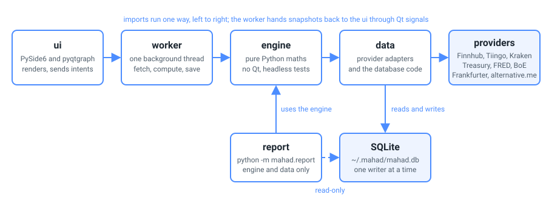

<div align="center">

# MAHAD

### A desktop market-risk workstation for live stock and crypto markets

 &nbsp;[](https://github.com/5Muawiyah/MAHAD/actions/workflows/tests.yml) &nbsp;

</div>

<p align="center"></p>

<p align="center"><i>One window: a live price chart, a watchlist, the risk panel, and a simulated portfolio with live profit and loss.</i></p>

**Start here:** the [plain-English overview](docs/overview.md) if you are not technical, or the [technical guide](docs/architecture.md) if you are.

| Document | What it covers |
|---|---|
| [Overview](docs/overview.md) | what MAHAD is, a tour of the screens, what the numbers mean |
| [Technical guide](docs/architecture.md) | how the code is split into layers, the background thread that does the work, the database, the eight data sources, the tests |
| [Requirements](docs/requirements.md) | what the program must do and how well, the user journeys with their acceptance checks, and which test proves each point |
| [Data dictionary](docs/data-dictionary.md) | the database's tables and columns, the provider fields, the derived figures, the report file |
| [Risk methodology](docs/risk-methodology.md) | every formula and convention |
| [Verification](docs/verification.md) | the hand-worked answers the tests check the formulas against |
| [Glossary](docs/glossary.md) | the terms, in plain English |

MAHAD (Multi-Asset Heuristic Analytics Dashboard: several asset classes, the practical rules of thumb a bank's risk team works by, one screen) is a desktop risk tool that runs on live market data. It charts stocks and crypto, runs a simulated USD portfolio with live profit and loss, and computes the market-risk figures described below. The portfolio is a simulation, so MAHAD holds no broker or trading credentials and never places a real order.

## Highlights

The window shows one symbol's price chart in bars from one minute to one month. A symbol is the short code for a share or a crypto pair, such as AAPL or BTC/USD, and a bar is one slice of time. Two indicators go with the chart: a pair of moving averages (smoothed lines of recent prices) drawn over it, and the RSI (relative strength index, a momentum gauge) beneath it. A watchlist follows several stocks and crypto pairs at once. Simulated buy and sell orders move a virtual USD portfolio, and its cash, positions (the shares and coins currently held) and profit and loss update at once. The risk panel computes the standard measures of how much the portfolio could lose on a bad day and how sure that estimate is, each defined in the [glossary](docs/glossary.md) and explained in the [overview](docs/overview.md). Market context tiles give the backdrop. They show US Treasury yields (what US government bonds pay) and the VIX index of expected market volatility, where volatility is the typical size of a day's move as a percentage. They also show the crypto Fear & Greed index, a daily sentiment score from 0 (extreme fear) to 100 (extreme greed), and the two UK rates, SONIA (the sterling overnight rate) and the Bank Rate. Alerts fire once when a price or indicator condition is met, and a command palette lists every command with its shortcut.

## A closer look

### Live chart with indicators

<p align="center"></p>

The price chart carries a simple and an exponential moving average (SMA and EMA) and the relative strength index (RSI), and switches across bar sizes from one minute to one month. The indicator lines are drawn only on completed price bars, so the newest, still-changing bar never makes them flicker.

### Watchlist


Follow stocks and crypto side by side; the badge counts them (five here, three in view). Each row shows the latest price, and clicking one makes it the active symbol on the chart. Crypto needs no API key (a free sign-up code; see API keys below) and updates around the clock, so a live BTC/USD chart appears within seconds of selecting it.

<br clear="all">

### Risk analytics


On the simulated portfolio the panel computes [Value-at-Risk](docs/glossary.md) (VaR, the loss a bad day could reach, read from past days or from a bell curve), Expected Shortfall (the average loss on the days at or beyond it) and each position's share of the total risk (component VaR). Beta says how much the portfolio moves with the market, and the Sharpe and Sortino ratios give the return per unit of variation. A smoothed volatility (EWMA, an exponentially weighted moving average that leans on recent days), concentration (how much sits in the largest positions) and a correlation heatmap (how closely the positions move together) describe how the portfolio is spread. A backtest counts how often losses beat the VaR and shows the result as the Basel traffic light, the supervisors' green, yellow and red reading, with the Kupiec statistical check in the row's tooltip. Replays of dated shocks such as the 2020 COVID crash show what past crises would have cost. Every figure is labelled with the period it covers (its window) and the price history it is measured on (its basis), so the same position's different percentages are never ambiguous.

<br clear="all">

### Market context


The market backdrop in one place, at the foot of the risk panel: the 10-year Treasury yield and the 2s10s spread (the gap between two- and ten-year yields), the VIX volatility index, the crypto Fear & Greed index, and the UK rates (SONIA, the sterling overnight rate, and the Bank Rate). All of these but the VIX run without a key; the VIX tile needs the free key for FRED, the St. Louis Fed's data service.

<br clear="all">

### Simulated orders


Place a simulated buy or sell from the order ticket. The ticket shows the live price as the mark and the estimated cost, and its button reads Confirm buy; the trade lands in the virtual portfolio the moment it is confirmed. No real order is ever placed, and no trading account is involved.

<br clear="all">

### Alerts

<p align="center"></p>

Set a price or indicator alert; it fires once, raises a notification, and is listed in the Alerts tab.

### Command palette


Press Ctrl+Shift+P for a searchable, keyboard-driven list of every command, each shown with its shortcut.

<br clear="all">

## What this demonstrates

The window is a PySide6 and Qt desktop application (Qt is the window toolkit and PySide6 its Python form) whose dark colour scheme meets the AA level of the Web Content Accessibility Guidelines (WCAG) for the contrast between text and its background. A missing or rejected key shows a message naming the source rather than a crash. Every risk formula is stated in [docs/risk-methodology.md](docs/risk-methodology.md) and checked against the hand-worked answers in [docs/verification.md](docs/verification.md), and the test suite runs with no window open on every change sent to GitHub, as the badge above shows.

## How it is built

<p align="center"></p>

The screen asks, a background thread does the work and reports back; a thread is a line of work that runs alongside the window's own. The window, the ui layer (user interface), renders and sends intents, requests such as add a symbol or place an order. One background worker thread fetches, computes and writes. The engine does the calculations in plain Python with no Qt, so the tests call it directly. The data layer wraps each of the eight providers (the market data sources) in an adapter, a small module that talks to one provider and turns a failed fetch into a message rather than a crash, and it owns the SQLite database, which lives in one file. Each layer calls only the one below it, from the window down to the data layer, and the worker hands complete snapshots (the whole picture the window shows) back through Qt signals, the toolkit's messages between threads. The [technical guide](docs/architecture.md) has the diagrams and a map of the code's files.

## Report export

```
python -m mahad.report
```

Writes the portfolio's risk figures to a CSV file (plain text that a spreadsheet opens) from the app's own database, read-only, so it runs whether or not the window is open. `--db`, `--out`, `--confidence` and `--window` are the options it takes; the [data dictionary](docs/data-dictionary.md) lists the columns.

## Tech stack

Python 3.11 to 3.13 · PySide6 / Qt · pyqtgraph · numpy · SQLite via SQLAlchemy. Live data from Finnhub and Tiingo (stocks), a keyless Kraken adapter (crypto), Frankfurter (the USD to GBP rate), the US Treasury, FRED, the Bank of England, and alternative.me (the Fear & Greed index).

## Getting started

MAHAD needs **Python 3.11, 3.12 or 3.13** (newer versions are not validated for MAHAD yet). Then:

```
git clone https://github.com/5Muawiyah/MAHAD.git
cd MAHAD
```

On Windows double-click `MAHAD.bat`, which sets up its own environment on the first run and then launches; on macOS or Linux run `bash run.sh`.

MAHAD launches fully keyless: crypto, the USD to GBP rate, Treasury yields, UK rates and the Fear & Greed gauge all work with no key.

### API keys (optional, free)

Live stock quotes and history, and the VIX tile, use free keys whose sign-up asks only for an email address. Without them MAHAD still runs, and the stock screens show a "needs a free key" message that points back here; everything keyless keeps working.

| Key | What it adds | Where to get it (free) |
|---|---|---|
| `FINNHUB_API_KEY` | live US stock quotes | finnhub.io/register |
| `TIINGO_API_KEY` | stock history, adjusted for dividends and splits | tiingo.com |
| `FRED_API_KEY` | the VIX tile (optional) | fred.stlouisfed.org |

Copy `.env.example` to `.env` and paste your keys in. The `.env` file is never added to the public code and never leaves your machine, and none of the keys can trade or move money. MAHAD uses FRED's data service but is not endorsed or certified by the Federal Reserve Bank of St. Louis.

## Run the tests

```
pip install -r requirements-dev.txt
python -m pytest -q
```

The suite is headless (no network, no display): it covers the risk maths, the data adapters (checked against saved sample responses from each provider), and the window's source code (the words on screen, the colours and the shortcuts the design depends on).

---

<div align="center"><sub>Built by Muawiyah Jahanzaib as a solo project. MIT licensed. A simulated USD portfolio for analysis and learning, not investment advice.</sub></div>
