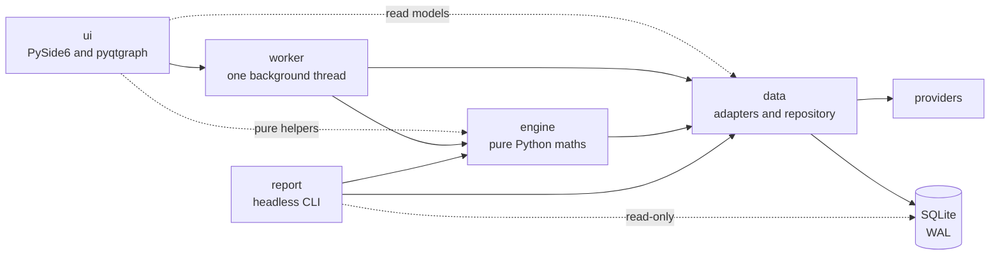
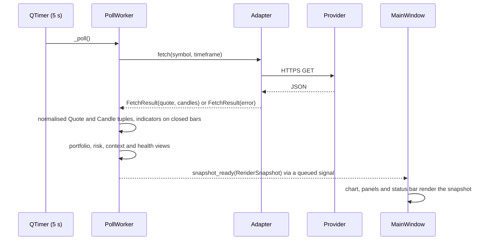

# Technical guide

MAHAD is a PySide6 desktop application with one background thread, a pure-Python risk engine and an SQLite file. This guide describes how the pieces fit, how a price travels from a provider to the screen, how the code is tested, and where to start when adding a provider or a metric. The formulas themselves are in the [methodology note](risk-methodology.md).

## The one-way layering

Imports run in one direction. The window imports the worker, and takes a few pure helpers straight from the engine (the `RenderSnapshot` type, the indicator settings and bounds, the alert constants, the alert rule with its parameter validator, summary text and bar-count helper, the quantity validator, the money rounding, the trade record, its timestamp format and the trade-log CSV builder, and the volatility caveat text); the worker imports the engine and the data layer; the engine imports the data models and the read models; nothing imports upwards. `config.py` sits underneath everything and knows nothing about Qt.

Three read-model modules live under `mahad/data/` and are the only data modules the window imports: `symbols.py` (watchlist and alert rows), `portfolio_view.py` (portfolio, risk and analytics views) and `context_view.py` (context tiles, health and data-integrity views). They hold frozen dataclasses plus a few small functions: the window calls the symbol helpers `classify`, `effective_active`, `normalize_symbol` and `unread_after_delete`, the CSV builders for the value history and the risk snapshot, and the analytics summary text, while the worker calls the symbol validator `validate_add` and the health classifier; the trade-log CSV builder lives with the ledger in `engine/portfolio.py`. None of them touches a provider or the database. The window never computes a risk figure; it renders what the worker publishes and sends intents back.

The engine is Qt-free and the report module (`mahad/report.py`) imports the engine and the data layer only. `tests/test_layering.py` walks every import under the four layers, the report module and `config.py` with the `ast` module and fails on any crossing: a UI module importing a data module other than the three read models or an engine module other than the five helper modules, an engine or data module importing upwards, the worker importing the UI, or the engine, the report or the config importing Qt.

## The path of a price

The worker polls the active symbol every five seconds (`config.POLL_INTERVAL_S`) from a timer on its own thread. The adapter returns a `FetchResult` whose `error` field carries a failure as a value; nothing in the data layer raises across the boundary.

`build_render_snapshot` in `engine/snapshot.py` turns candles and a quote into chart points and indicator lines, computing indicators on closed bars only. The worker then attaches the portfolio view (positions marked at the latest quotes), the risk view (the value-history metrics), the market-context tiles, the health chip, the analytics view and the data-integrity view, and emits the whole `RenderSnapshot`. On a failure the worker keeps the last good quote, marks it stale, enters a capped exponential backoff (10, 20 and 40 seconds after the first three failures, then the 60-second cap `config.BACKOFF_CAP_S`, each window jittered by a quarter either way) and still emits a snapshot so the window can show the reason. A user intent clears the backoff.

Held positions that are not the active symbol are marked on a budget: crypto marks ride one batched Kraken ticker call, stocks round-robin three per cycle (`config.HELD_POLL_BUDGET`) at a tighter three-second timeout.

## The threading model

There is one `QThread`. `MainWindow` creates it, moves the `PollWorker` into it, connects the thread's `started` signal to `PollWorker.start`, and connects every worker signal to a window slot before the thread starts. Because the two objects live on different threads, Qt queues each signal onto the receiving thread: the worker never touches a widget, and the window never touches the network or the database.

Two kinds of channel run from the worker to the window. The snapshot channel (`snapshot_ready`, `watchlist_ready`, `alerts_ready`) carries complete state on every emission, so whichever emission arrives last is the one worth rendering; the chart also discards a snapshot for a symbol the user has already switched away from, through its pending-switch guard. The discrete channels (`alert_events`, `order_result`, `add_rejected`, `remove_rejected`, `alert_rejected`, `settings_applied`, `db_notice`, and `indicator_settings_ready`, sent once at start) carry one-off outcomes that must never be merged or lost: an alert firing, an order filling or being refused, a rejected symbol, a database that could not be opened, the saved indicator settings.

Intents travel the other way as queued slots on the worker: add and remove a symbol, change the indicator settings, place a simulated order, reset the portfolio, clear the trade log, arm, disarm, re-arm and remove alerts, change the risk timeframe, and retry a poll (the chart's Retry button, which also clears the backoff). Selects and timeframe clicks are coalesced in the window through a 250 ms single-shot timer so a burst of clicks becomes one fetch. Those two, `select_symbol` and `set_timeframe`, ride two `Signal(str)` attributes of `MainWindow` that the timer's slot emits, connected to the worker's slots before the thread starts, so the active-symbol write to SQLite, the restart of the poll timer, the one-shot poll and, for a stock with no cached history, the Tiingo pull all run on the worker thread like every other intent. `test_symbol_and_timeframe_intents_ride_queued_signals` in `tests/test_context_wiring_guards.py` pins the wiring, because a direct call from the window thread would make Qt refuse the timer restart and leave the five-second poll stopped.

A second timer on the worker thread, the heartbeat (`config.HEARTBEAT_INTERVAL_S`, five seconds), drives the slow work off a wall-clock grid: sampling the portfolio value on the risk timeframe (one minute, one hour or one day, catching up one sample after a sleep and keeping the grid), refreshing at most one context source per tick, refreshing at most one symbol's daily history per tick when no context refresh ran, and rebuilding the analytics when the daily data changed.

Shutdown is cooperative and bounded. `MainWindow.closeEvent` requests interruption on the thread, emits a queued stop and waits for a budget that covers a worst legal poll cycle (two request timeouts, three held-mark timeouts and five seconds) before terminating. `PollWorker.stop` runs on the worker thread, stops the timers, closes the repository and then quits the thread's own loop, so the loop ends after the stop rather than before it; in-flight and queued work checks the interruption flag between steps. `test_the_worker_quits_its_thread_from_the_stop_slot` pins that order.

## The worker package

`mahad/worker/` holds one `QObject` subclass, `PollWorker` in `poll.py`, which owns every signal and every piece of state. Its methods are grouped by responsibility into mixins that `PollWorker` combines, each in its own module: `alerts.py` (evaluation, arming and the alerts view), `portfolio.py` (the simulated book, marks, the value-history sampling, orders and reset), `daily.py` (daily-bar coverage and the official one-day series), `analytics.py` (the risk-analytics assembly, sectors, stress rows and the backtest accrual) and `context.py` (the context tiles, their cache, the health and data-integrity views). `state.py` declares the attributes, signals and cross-part methods once so each part type-checks on its own; at runtime it is a plain class, and `PollWorker` alone derives from `QObject`. The package re-exports `PollWorker`, so `from mahad.worker import PollWorker` is the only import the window needs.

## Persistence

The database is an SQLite file at `~/.mahad/mahad.db` (`config.data_dir()`), opened through SQLAlchemy 2 in `mahad/data/repository.py`. On every connection the repository sets `journal_mode=WAL`, a `busy_timeout` of five seconds and `foreign_keys=ON`. Decimal amounts are stored as text through a `TypeDecorator`, never as floats, so the ledger stays exact. The schema is described column by column in the [data dictionary](data-dictionary.md).

One `Session` is created on the worker thread and owned by it. The worker is the single writer: the window never opens the file. A one-time migration renames rows from retired providers and quote currencies and records a marker in the settings table so it never runs twice. If the file cannot be opened the worker falls back to an in-memory database and emits `db_notice` once, so the session runs without saving and the window says so. A corrupt file is backed up with a `.corrupt-<timestamp>` suffix and recreated; a lock error is re-raised untouched rather than rotating a healthy file.

The headless report is the documented exception to the single-writer rule, and it keeps the rule intact by never writing. `mahad/report.py` opens the same file through the repository with an SQLite URI of the form `sqlite:///file:<path>?mode=ro&uri=true` and asks the repository to skip its create-tables step, so the start-up path only reads the schema-version row and never issues a `CREATE TABLE`; in that mode SQLite refuses every write, a missing file is an error and is never created, and if the file lacks a table the report stops with the SQLite error naming it rather than creating it. WAL mode is what makes this safe while the application is running: readers and the one writer do not block each other, and a read sees a consistent snapshot of the file. A second write-capable session was not the answer because the worker holds the book, the value history, the alerts and the settings in memory and adopts state only after its own commits, so a write from another process would never reach the running application.

## Providers

| Source | Access | Endpoints used | Cadence | Failure handling |
|---|---|---|---|---|
| Finnhub | free key, `FINNHUB_API_KEY` | `/api/v1/quote` for the live mark; `/api/v1/stock/profile2` once per added stock for its sector | every poll for the active stock; held stocks three per cycle; a worker-side budget of 55 calls a minute serves the cached quote on a denied tick | `needs_key` without a key, `invalid_key` on HTTP 401, `timeout`, `network`, `empty` for an unknown symbol; the key is redacted from error text |
| Tiingo | free key, `TIINGO_API_KEY` | `/tiingo/daily/{symbol}/prices` for adjusted daily bars (750 calendar days on first pull, then a delta from the latest cached date, a full re-pull when a corporate action changes the adjusted history); `/iex/{symbol}/prices` once per symbol and timeframe for one-minute and one-hour backfill | nightly, retry after 30 minutes on failure | the same error kinds; the paid-tier 403 on intraday degrades to a value |
| Kraken | no key | `/0/public/Ticker` for marks, batched for every held pair; `/0/public/OHLC` at 1, 60, 1440 and 10080 minute intervals; three-day and one-month bars are resampled from daily | every poll for the active pair; daily bars nightly | body-level errors are read from the payload's `error` list; an unknown pair is `empty` |
| Frankfurter | no key | `/v2/latest?base=USD&symbols=GBP&providers=ECB` | every 12 hours | display-only; a stale rate carries a note |
| US Treasury | no key | the daily par yield curve CSV for the year, falling back to the previous year in early January | every 12 hours | the newest row with both the two-year and ten-year legs wins |
| FRED | free key, `FRED_API_KEY` | `/fred/series/observations` for `VIXCLS` | every 12 hours | without a key the tile shows the keyless state; the key is redacted from errors |
| Bank of England | no key | the IADB CSV for `IUDSOIA` (SONIA) and `IUDBEDR` (Bank Rate) over the last 45 days | every 12 hours | the latest value per series with its own date |
| alternative.me | no key | `/fng/?limit=2` | every 12 hours | values outside 0 to 100 are rejected |

Every adapter builds requests with the standard library's `urllib`, sends a fixed `User-Agent` string and never sends credentials anywhere but the one provider that issued them. The context sources refresh one per heartbeat tick on a staggered start, and a failed refresh keeps the last good tile with a note and retries after 30 minutes (`config.CONTEXT_RETRY_S`). Provider state feeds the health chip and the data-integrity view, which also lists missing trading days in the cached daily history against the NYSE calendar in `engine/market_session.py`.

## The risk engine boundary

`mahad/engine/` is pure Python with numpy: indicators, alert signals, the exact-Decimal ledger, the wall-clock risk metrics, the trading-day return series and analytics, the assembly steps the panel and the report share (`engine/analytics.py`: the sector map, the stress-window lookup and rows, the backtest summary), the NYSE calendar, resampling and the snapshot builder. Nothing in it imports Qt, and the tests import it directly. Three modules carry the risk formulas: `risk.py` (exposure, volatility and maximum drawdown on the value history), `returns.py` (the aligned daily return series and the as-if portfolio series) and `risk_metrics.py` (VaR, Expected Shortfall, the Kupiec test and the Basel zones, beta, Sharpe, Sortino, EWMA, correlation, concentration, drawdown duration, stress replay, component VaR). The [verification note](verification.md) tables hand-worked vectors for seventeen of these functions, from the normal quantile to the stress replay, and `tests/test_risk.py`, `tests/test_returns.py` and `tests/test_risk_metrics.py` pin the code to them; the remaining functions, such as the value-history volatility, the return alignment and the rolling VaR, are pinned to vectors that live in those same test files. The conventions the vectors lock in (order statistics rather than interpolation, `ddof = 1`, no SciPy, the Euler identities) are stated in the [methodology note](risk-methodology.md).

## The test strategy

The suite under `tests/` runs with no network and no display, and it imports no Qt. `tests/_qt_stub.py` installs a stand-in for `PySide6.QtCore` before the worker is imported: its `Signal` records every emission in a list, its `QTimer` never fires so tests drive the slots by hand, and its `Slot` is a no-op decorator. The worker tests build a real `PollWorker` on a temporary SQLite file and inject fake adapters and clocks through the seams the worker exposes for that purpose.

Captured provider payloads live under `tests/fixtures/providers` and `tests/fixtures/context`, alongside a generic OHLCV row set for the normaliser and a sample trade CSV, so the adapters are checked against real shapes. `tests/test_fuzz.py` holds property-based tests written with Hypothesis: the validators for symbols, quantities and alert parameters are total functions, the ledger reconstructs from its own CSV, and the indicators stay within their bounds on random input. `tests/test_security.py` feeds SQL-injection strings, markup and hostile CSV cells through the same paths and checks they land as inert data.

A group of source-invariant tests reads the UI source as text and pins the exact strings the design depends on: WCAG AA contrast on the painted colours, the copy the panels show, the wiring of signals to slots, the single-flight guards on dialogs. They exist because the window itself never runs under the suite; the window is booted instead by `python -m mahad --smoke`, which starts the application offscreen, constructs the main window, starts the worker and exits after three seconds, or with code 1 on any exception. `tests/test_perf.py` records medians with pytest-benchmark against loose bounds.

GitHub Actions runs the suite on Ubuntu and Windows across Python 3.11, 3.12 and 3.13: ruff, mypy over `mahad`, pytest, and on the Windows jobs the offscreen smoke boot.

## Module map

| Module | Purpose |
|---|---|
| `mahad/__main__.py` | `python -m mahad` entry point |
| `mahad/app.py` | builds the `QApplication`, logging with query strings redacted, the window icon, the `--smoke` flag |
| `mahad/config.py` | every tunable: poll and heartbeat intervals, caps, windows, confidences, provider keys' names, stress scenarios |
| `mahad/report.py` | the headless risk report CLI |
| `mahad/data/models.py` | the frozen `Quote` and `Candle` |
| `mahad/data/source.py` | `FetchResult`, `SourceError`, the `MarketDataSource` protocol, OHLCV normalisation, adapter selection by symbol |
| `mahad/data/budget.py` | a sliding-window call budget |
| `mahad/data/finnhub_source.py` | live stock marks and sectors from Finnhub |
| `mahad/data/tiingo_source.py` | adjusted daily history and intraday backfill from Tiingo |
| `mahad/data/stock_source.py` | the stock adapter: Finnhub marks, sampled bars, Tiingo history |
| `mahad/data/sampled_bars.py` | builds one-minute, one-hour and one-day bars from a stream of marks |
| `mahad/data/kraken_source.py` | keyless crypto marks and candles from Kraken's public endpoints |
| `mahad/data/context_sources.py` | Treasury, Fear & Greed, VIX, Frankfurter and Bank of England fetchers; `.env` key loading |
| `mahad/data/context_view.py` | the context tiles, health, data-integrity and FX read models |
| `mahad/data/portfolio_view.py` | the portfolio, risk and analytics read models and their CSV exports |
| `mahad/data/symbols.py` | symbol validation and the watchlist and alert read models |
| `mahad/data/repository.py` | the SQLAlchemy schema and every read and write |
| `mahad/engine/indicators.py` | SMA, EMA and Wilder RSI |
| `mahad/engine/signals.py` | alert rules, crossover and threshold evaluation |
| `mahad/engine/portfolio.py` | the exact-Decimal ledger, order placement, the trade CSV |
| `mahad/engine/risk.py` | exposure, volatility and maximum drawdown on the value history |
| `mahad/engine/returns.py` | trading-day alignment, the as-if portfolio return series, gap detection |
| `mahad/engine/risk_metrics.py` | the trading-day analytics |
| `mahad/engine/analytics.py` | the sector map, stress rows and backtest summary the panel and the report share |
| `mahad/engine/market_session.py` | the NYSE calendar, session state and next-open labels |
| `mahad/engine/resample.py` | daily candles into three-day, weekly and monthly bars |
| `mahad/engine/context.py` | the 2s10s spread, curve reading and VIX bands |
| `mahad/engine/snapshot.py` | `RenderSnapshot` and its builder |
| `mahad/worker/poll.py` | `PollWorker`: signals, the poll loop, intents, switching, the heartbeat |
| `mahad/worker/alerts.py` | alert evaluation and arming |
| `mahad/worker/portfolio.py` | the simulated book, value-history sampling, orders |
| `mahad/worker/daily.py` | daily-bar coverage and the official one-day series |
| `mahad/worker/analytics.py` | the analytics assembly, stress rows, the backtest accrual |
| `mahad/worker/context.py` | context tiles, their cache, health and integrity views |
| `mahad/worker/state.py` | the worker's attribute and signal declarations |
| `mahad/ui/main_window.py` | the window: layout, thread wiring, intents, shortcuts, shutdown |
| `mahad/ui/chart_view.py` | the pyqtgraph price and RSI plots |
| `mahad/ui/watchlist_panel.py` | the watchlist |
| `mahad/ui/risk_panel.py` | the risk, analytics and context panel |
| `mahad/ui/portfolio_panel.py` | cash, positions and P&L |
| `mahad/ui/trade_log_panel.py` | the trade log and its CSV export |
| `mahad/ui/alerts_tab.py` | the alerts list |
| `mahad/ui/alert_dialog.py` | the new-alert dialog |
| `mahad/ui/order_ticket.py` | the simulated order ticket |
| `mahad/ui/reset_dialog.py` | the portfolio reset dialog |
| `mahad/ui/settings_dialog.py` | the settings dialog |
| `mahad/ui/indicator_popover.py` | the indicator overlay popover |
| `mahad/ui/command_palette.py` | the command palette |
| `mahad/ui/glass_dialog.py` | the shared dialog frame |
| `mahad/ui/toast.py` | toast notifications |
| `mahad/ui/widgets.py` | shared widgets: icon buttons, segmented controls, status dots |
| `mahad/ui/theme.py` | colours, fonts, the stylesheet and the help copy |

## Adding a provider

A market-data provider implements the two methods of the `MarketDataSource` protocol in `data/source.py`, `fetch(symbol, timeframe)` and `fetch_mark(symbol)`, returning a `FetchResult` whose `quote` and `candles` are built from the frozen models and whose `error` is a `SourceError` with one of the fixed kinds. `normalize_ohlcv` and `dedupe_sort_candles` do the row cleaning. `source_for_symbol` in the same module chooses the adapter, and a captured payload under `tests/fixtures/providers` with tests in `tests/test_market_data_providers.py` proves the parsing and each failure path. A reference-data source is a function in `data/context_sources.py` returning a `ContextResult`, a tile dataclass in `data/context_view.py`, a builder and refresh branch in `worker/context.py`, and a fixture under `tests/fixtures/context`.

## Adding a metric

A metric is a pure function in `engine/risk_metrics.py` that takes plain sequences and returns a frozen result or `None` when the inputs cannot support it. It gets a hand-worked vector in the [verification note](verification.md) and a test in `tests/test_risk_metrics.py` that pins the function to it, a field on `RiskAnalyticsView` in `data/portfolio_view.py`, a line in `_build_analytics_view` in `worker/analytics.py`, a row in the analytics section of `ui/risk_panel.py` with its window and basis label, and a row in `mahad/report.py`.
